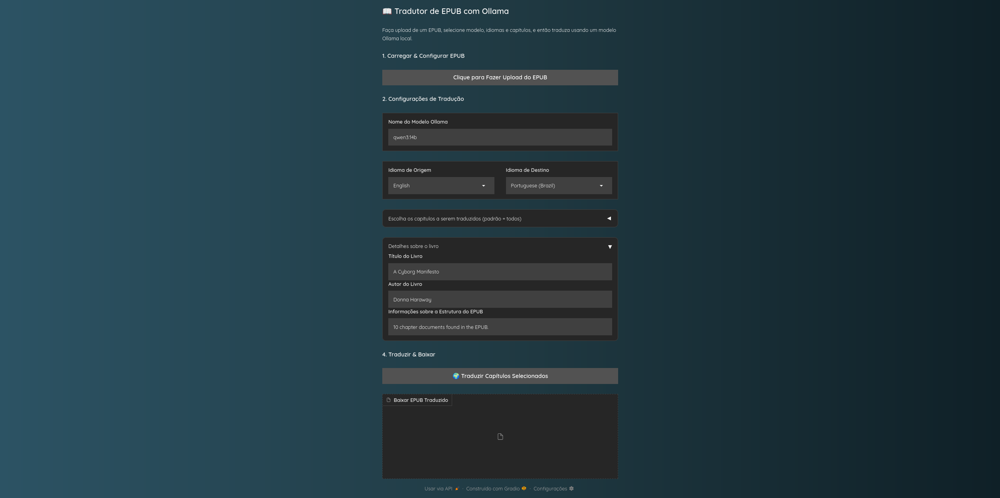

# Tradutor de Livros EPUB com IA Local



Este é um projeto de código aberto que utiliza o poder de Grandes Modelos de Linguagem (LLMs) rodando localmente através do Ollama para traduzir livros no formato EPUB.

A ferramenta oferece uma interface web simples e intuitiva, construída com Gradio, que permite a você fazer o upload de um livro, selecionar os capítulos que deseja traduzir, escolher os idiomas e o modelo de IA, e obter uma versão traduzida do seu EPUB, mantendo a formatação original.

(Recomendação: Substitua o link acima por um screenshot real da sua aplicação em funcionamento)

## Principais Funcionalidades

- **Tradução de Arquivos .epub**: Faça o upload do seu livro e receba um novo arquivo .epub traduzido.
- **Usa LLMs Locais via Ollama**: Total privacidade e sem custos de API. Toda a tradução acontece na sua própria máquina.
- **Preservação da Formatação**: O tradutor processa o conteúdo HTML de cada capítulo, mantendo tags como parágrafos (`<p>`), cabeçalhos (`<h1>`, `<h2>`), listas, etc.
- **Seleção de Capítulos**: Visualize os capítulos do livro e escolha exatamente quais deseja traduzir.
- **Detecção Automática de Idioma**: Tenta identificar o idioma de origem do livro para facilitar a configuração.
- **Interface Web Amigável**: Interface simples criada com Gradio para um fluxo de trabalho fácil: upload, configure, traduza e baixe.
- **Prompt de Tradução Avançado**: Utiliza um prompt de sistema detalhado para instruir o LLM a agir como um especialista em localização, garantindo traduções de alta qualidade que consideram nuances culturais e contexto.

## Pré-requisitos

Antes de rodar o projeto, você precisa ter o seguinte instalado e configurado:

- **Python 3.8+**: [Instale Python](https://www.python.org/downloads/).
- **Ollama**: A ferramenta que permite rodar LLMs localmente.
  - Faça o download e instale o [Ollama](https://ollama.ai).
  - Após a instalação, certifique-se de que o Ollama está em execução.
  - Baixe os modelos que você pretende usar. Exemplos:
    ```bash
    ollama pull qwen2:7b
    ollama pull mistral
    ollama pull phi3
    ```

## Instalação

Siga estes passos para configurar o ambiente do projeto:

### 1. Clone o repositório:
```bash
git clone <URL_DO_SEU_REPOSITORIO>
cd <NOME_DA_PASTA_DO_PROJETO>
```

### 2. Crie e ative um ambiente virtual (recomendado):
```bash
# Para Unix/macOS
python3 -m venv venv
source venv/bin/activate

# Para Windows
python -m venv venv
.\venv\Scripts\activate
```

### 3. Instale o [UV](https://docs.astral.sh/uv/)
Se ainda não tem o UV instalado, use:
```bash
# No Linux/macOS
curl -LsSf https://install.python-poetry.org | python3 -

# Ou siga as instruções oficiais: https://docs.astral.sh/uv/guides/installation/
```

### 4. Instale as dependências usando UV:
Este projeto usa um arquivo `pyproject.toml`, então você pode instalar todas as dependências com UV:

```bash
uv pip install -e .
```

> Este comando lerá o `pyproject.toml` e instalará as dependências listadas, como `gradio`, `ebooklib`, `openai`, entre outros.

## Como Usar

1. **Inicie o Servidor Ollama**: Certifique-se de que o aplicativo Ollama está rodando em sua máquina.

2. **Execute a Aplicação**:
   Com o ambiente virtual ativado, execute:
   ```bash
   python main.py
   ```

3. **Abra a Interface Web**:
   O terminal mostrará um endereço local, geralmente `http://127.0.0.1:7860`. Abra este link no seu navegador.

4. **Siga os Passos na Interface**:
   - **Upload**: Clique no botão para fazer o upload do seu arquivo `.epub`.
   - **Configure**:
     - Escolha o modelo de IA que você baixou no Ollama (ex: `qwen2:7b`).
     - Selecione o idioma de origem e o idioma de destino. "Auto-Detect" é a opção padrão para a origem.
     - Expanda a seção de capítulos e selecione os capítulos que deseja traduzir (todos vêm pré-selecionados).
   - **Traduza**: Clique no botão *"Traduzir Livro"*.
   - **Download**: Acompanhe o progresso. Quando a tradução terminar, um link para download do arquivo `.epub` traduzido aparecerá.

## Configuração

As principais configurações podem ser ajustadas diretamente no início do arquivo `main.py`:

- `DEFAULT_OLLAMA_BASE_URL`: Endereço do seu servidor Ollama (geralmente `http://localhost:11434/v1`).
- `SUGGESTED_MODELS`: Lista de modelos sugeridos no campo de texto da interface.
- `DEFAULT_MODEL`: O modelo que aparecerá pré-selecionado.
- `MAX_EPUB_SIZE_MB`: Tamanho máximo permitido para o upload de arquivos EPUB.

## Licença

Este projeto é liberado sob a [The Unlicense](http://unlicense.org/).

Isso significa que ele é efetivamente em domínio público. Você é livre para fazer o que quiser com o código: usar, copiar, modificar, distribuir, vender, etc., sem nenhuma restrição ou necessidade de atribuição.

---

Se quiser, posso também te ajudar a gerar um `uv`-based workflow no GitHub Actions ou qualquer outro automatizador que use esse projeto.